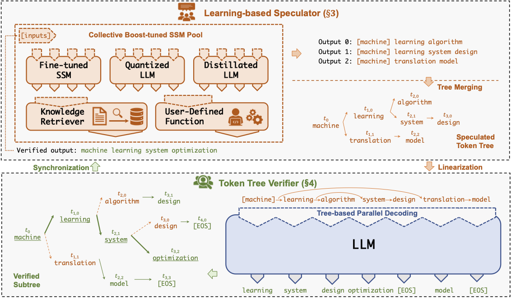
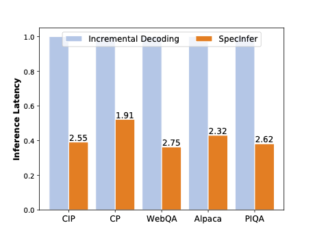

# SpecInfer
       [](https://flexflow.readthedocs.io/en/latest/?badge=latest)


## What is SpecInfer

<p align="center">

</p>
  
The high computational and memory requirements of generative large language
models (LLMs) make it challenging to serve them quickly and cheaply. 
SpecInfer is an open-source system that accelerates generative LLM
inference with speculative inference and token tree verification. A key insight
behind SpecInfer is to combine various collectively boost-tuned small language
models to jointly predict the LLM’s outputs; the predictions are organized as a
token tree, whose nodes each represent a candidate token sequence. The correctness
of all candidate token sequences represented by a token tree is verified against the
LLM’s output in parallel using a novel tree-based parallel decoding mechanism.
SpecInfer uses an LLM as a token tree verifier instead of an incremental decoder,
which largely reduces the end-to-end inference latency and computational requirement
for serving generative LLMs while provably preserving model quality.

<p align="center">

</p>

## Install SpecInfer
SpecInfer can be automatically installed by building the inference branch of FlexFlow. Please read the [instructions](INSTALL.md) for installing FlexFlow from source code. If you would like to quickly try SpecInfer, we also provide pre-built Docker packages ([flexflow-cuda](https://github.com/flexflow/FlexFlow/pkgs/container/flexflow-cuda) with a CUDA backend, [flexflow-hip_rocm](https://github.com/flexflow/FlexFlow/pkgs/container/flexflow-hip_rocm) with a HIP-ROCM backend) with all dependencies pre-installed (N.B.: currently, the CUDA pre-built containers are only fully compatible with host machines that have CUDA 11.7 installed), together with [Dockerfiles](./docker) if you wish to build the containers manually. 

## Run SpecInfer
The source code for the SpecInfer pipeline is available at [this folder](../inference/spec_infer/), and the SpecInfer executable will be available at `/build_dir/inference/spec_infer/spec_infer`. You can use the following command-line arguments:

* `-ll:gpu`: number of GPU processors to use on each node for serving an LLM (default: 0)
* `-ll:fsize`: size of device memory on each GPU in MB
* `-ll:zsize`: size of zero-copy memory (pinned DRAM with direct GPU access) in MB. SpecInfer keeps a replica of the LLM parameters on zero-copy memory, so you want to make sure the zero-copy memory is sufficient for storing the LLM parameters.
* `-llm-weight`: path to the folder that stores the LLM weights
* `-ssm-weight`: path to the folder that stores the small speculative models' weights
* `-tokenizer`: path to the tokenizer file (see [Tokenizers](#tokenizers) for preparing a tokenizer for SpecInfer)
* `-prompt`: (optional) path to the prompt file. SpecInfer expects a json format file for prompts, all of which will be served by SpecInfer. In addition, users can also use the following API for registering requests:

```c++
class RequestManager {
  RequestGuid register_new_request(std::string const &prompt, int max_sequence_length);
}
```
For example, you can use the following command line to serve a LLaMA-6B or LLaMA-13B model on 4 GPUs and use two collectively boost-tuned LLaMA-190M models for speculative inference.

```bash
./inference/spec_infer/spec_infer -ll:gpu 4 -ll:fsize 14000 -ll:zsize 30000 -llm-weight /path/to/llm/weights -ssm-weight /paths --tokenizer ../tokenizer.model --prompt ../piqa.json

```

### Tokenizers
SpecInfer supports two tokenizers:

* The [SentencePiece tokenizer](https://github.com/google/sentencepiece), which is used to support the LLaMA model family (e.g., LLaMA-6B, LLaMA-13B, and LLaMA-190M in our demo).
* The pretrained sentence piece tokenizer we use is from Hugging Face (model id: [decapoda-research/llama-7b-hf](https://huggingface.co/decapoda-research/llama-7b-hf)), developed by the FAIR team of Meta AI.

## TODOs

SpecInfer is under active development. We currently focus on the following tasks and strongly welcome all contributions to SpecInfer from bug fixes to new features and extensions.

* Low-precision and mixed-precision support. The current version uses single-precision floating points for computing tree attention. We are actively working on support half-precision floating points, and int-4 and int-8 quantizations.
* 


## Acknowledgements
This project is initiated by members from CMU, Stanford, and UCSD. We will be continuing developing and supporting SpecInfer and the underlying FlexFlow runtime system. The following paper describes design, implementation, and key optimizations of SpecInfer.

* Xupeng Miao*, Gabriele Oliaro*, Zhihao Zhang*, Xinhao Chen, Zeyu Wang, Rae Ying Yee Wong, Zhuoming Chen, Daiyaan Arfeen, Reyna Abhyankar, and Zhihao Jia. [SpecInfer: Accelerating Generative LLM Serving with Speculative Inference and Token Tree Verification]().

## License
Both SpecInfer and FlexFlow use Apache License 2.0.
