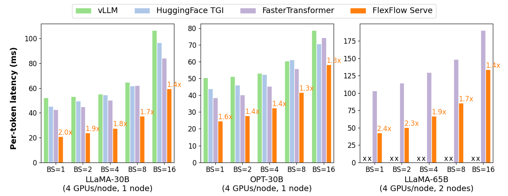

# SpecInfer
       

## What is SpecInfer

  
The high computational and memory requirements of generative large language
models (LLMs) make it challenging to serve them quickly and cheaply. 
SpecInfer is an open-source system that accelerates generative LLM
inference with speculative inference and token tree verification. A key insight
behind SpecInfer is to combine various collectively boost-tuned small language
models to jointly predict the LLM’s outputs; the predictions are organized as a
token tree, whose nodes each represent a candidate token sequence. The correctness
of all candidate token sequences represented by a token tree is verified against the
LLM’s output in parallel using a novel tree-based parallel decoding mechanism.
SpecInfer uses an LLM as a token tree verifier instead of an incremental decoder,
which largely reduces the end-to-end inference latency and computational requirement
for serving generative LLMs while provably preserving model quality.

## Install SpecInfer
SpecInfer can be automatically installed by building the inference branch of FlexFlow. Please read the [instructions](INSTALL.md) for installing FlexFlow from source code. If you would like to quickly try SpecInfer, we also provide pre-built Docker packages ([flexflow-cuda](https://github.com/flexflow/FlexFlow/pkgs/container/flexflow-cuda) with a CUDA backend, [flexflow-hip_rocm](https://github.com/flexflow/FlexFlow/pkgs/container/flexflow-hip_rocm) with a HIP-ROCM backend) with all dependencies pre-installed (N.B.: currently, the CUDA pre-built containers are only fully compatible with host machines that have CUDA 11.7 installed), together with [Dockerfiles](./docker) if you wish to build the containers manually. You can also use `conda` to install the FlexFlow Python package (coming soon).

## Run SpecInfer
The SpecInfer executable is available at `build_dir/inference/spec_infer/spec_infer`

### Tokenizers
SpecInfer supports two tokenizers:

* 

## Contributing
Please let us know if you encounter any bugs or have any suggestions by [submitting an issue](https://github.com/flexflow/flexflow/issues).

We welcome all contributions to SpecInfer from bug fixes to new features and extensions.

## Acknowledgements
This project is initiated by members from CMU, Stanford, and UCSD. We will be continuing developing and supporting SpecInfer and the underlying FlexFlow runtime system.

## License
SpecInfer and FlexFlow uses Apache License 2.0.
