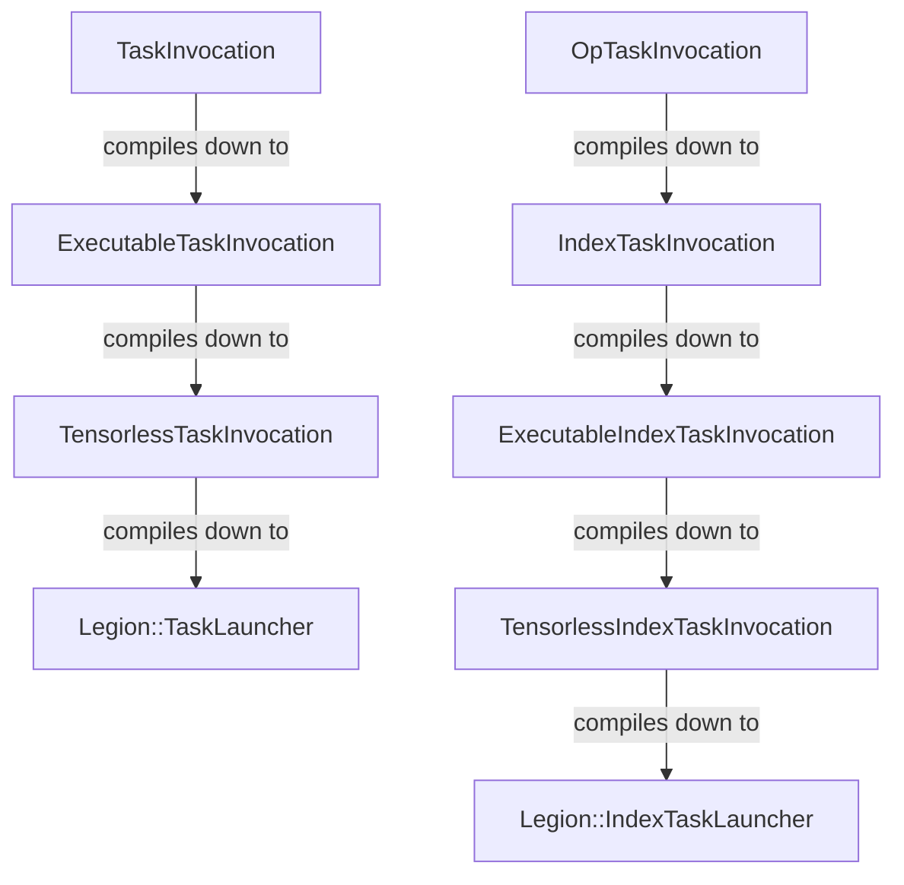
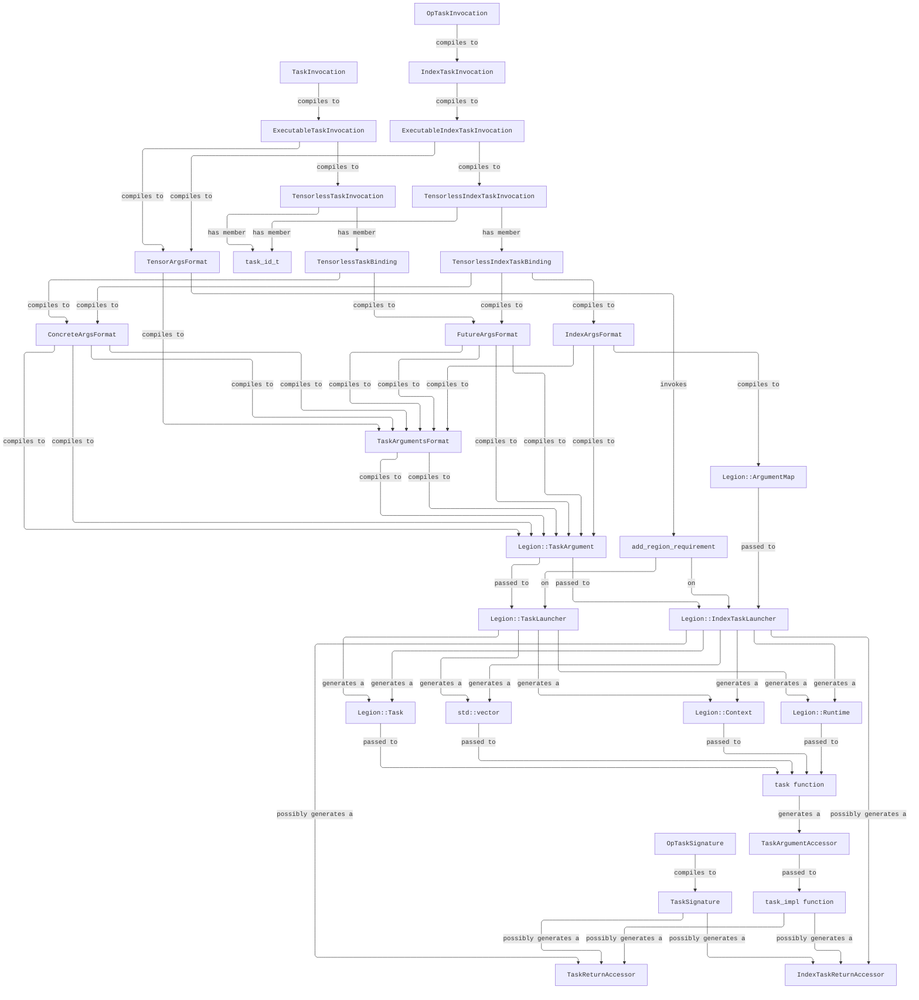

# task\_spec

The `task_spec` interface provides an easy-to-use, high-level, and safe abstraction on top of Legion tasks.
While not all Legion features are supported, the `task_spec` interface is capable of expressing all Legion usages in FlexFlow.
Using `task_spec` is not mandatory (Legion still works fine, as everything simply compiles down to Legion `TaskLauncher`, etc. 
anyway), but any code that can use `task_spec` is strongly advised to use it as it is significantly less verbose, safer, and 
prevents common errors.

The `task_spec` code consists of two parts: `TaskSignature` ([task\_signature.h](./task_signature.h)) and `TaskInvocation` ([task\_invocation.h](./task_invocation.h)), 
which can be intuitively understood as function signatures and function calls in a typical programming language.
`TaskSignature`s define a set of _slots_ of two kinds: 
each can be either a _tensor slot_, which represents a parallel tensor whose Legion region will be passed to the underlying task, 
or an _argument slot_, which can be used to pass small[^1] values of arbitrary[^2] type via `Legion::TaskArgument`.

As with function signatures/calls, each task has a single `TaskSignature` but can have multiple `TaskInvocation`s.
`TaskSignature`s are registered for `task_id_t`s via the `register_task` function, which is usually called by specializations of `template <task_id_t> register_task` 
defined in the relevant file (e.g., [optimizer.h](../optimizer.h) and [optimizer.cc](../optimizer.cc)), which are ultimately called by 
`register_flexflow_internal_tasks` in [tasks.cc](../tasks.cc).

To execute a pair of a `TaskSignature` and a `TaskInvocation`, they must be compiled/translated/lowered to a call to a `Legion::TaskLauncher` or a 
`Legion::IndexTaskLauncher`.
Ideally this would simply be done in a single step, but in practice the ability to specify `TaskInvocation`s at different layers of abstraction can 
be very useful.
Thus, what we previously referred to as `TaskInvocation` is actually logically the following set of classes:

Similarly, `TaskSignature` is actually divided up into `OpTaskSignature` and `TaskSignature`.
The flow of full compilation process is as follows:

The primary difference between the different `TaskInvocation` types is which argument types they support.
The full list of argument types is:
- tensor slots
  - `OpTensorSpec`: a reference to a input, output, or weight tensor attched to the given operator. 
  - `ParallelTensorSpec`: a reference (via `parallel_tensor_guid_t`) to a parallel tensor somewhere in the PCG.
- argument slots
  - `OpArgRefSpec`: an argument that should be filled in during the compilation process from `OpTaskInvocation` to `TaskInvocation`. For those familiar with `Reader` monads, this is roughly analogous
  - `ConcreteArgSpec`: a concrete value
  - `IndexArgSpec`: a set of concrete values, each of which should be sent to a different Index Task
  - `CheckedTypedFuture`: a legion future whose value should be passed into the task
  - `CheckedTypedFutureMap`: a set of legion futures, each of which should have its value sent to a different Index Task (conceptually, `IndexArgSpec` + `CheckedTypedFuture`)
  - `ArgRefSpec`: an argument that should be filled in during the compilation process from `TaskInvocation` to `ExecutableTaskInvocation`. For those familiar with `Reader` monads, this is roughly analogous
  - `TaskInvocationSpec`: a nested task invocation which should be launched and have its resulting `Future` passed into the given task
  - `IndexTaskInvocationSpec`: (currently not implemented, may or may not be necessary)

The supported argument types for each invocation type are:
- `OpTaskInvocation`
  - `OpTensorSpec`, `OpArgRefSpec`, `ConcreteArgSpec`, `IndexArgSpec`, `CheckedTypedFuture`, `CheckedTypedFutureMap`, `ArgRefSpec`, `TaskInvocationSpec`, `IndexTaskInvocationSpec`
- `TaskInvocation`
  - `ParallelTensorSpec`, `ConcreteArgSpec`, `CheckedTypedFuture`, `ArgRefSpec`, `TaskInvocationSpec`
- `IndexTaskInvocation`
  - `ParallelTensorSpec`, `ConcreteArgSpec`, `IndexArgSpec`, `CheckedTypedFuture`, `CheckedTypedFutureMap`, `ArgRefSpec`, `TaskInvocationSpec`, `IndexTaskInvocationSpec`
- `ExecutableTaskInvocation`
  - `ParallelTensorSpec`, `ConcreteArgSpec`, `CheckedTypedFuture`, `TaskInvocationSpec`
- `ExecutableIndexTaskInvocation`
  - `ParallelTensorSpec`, `ConcreteArgSpec`, `IndexArgSpec`, `CheckedTypedFuture`, `CheckedTypedFutureMap`, `TaskInvocationSpec`, `IndexTaskInvocationSpec`
- `TensorlessTaskInvocation`
  - `ConcreteArgSpec`, `CheckedTypedFuture`, `TaskInvocationSpec`
- `TensorlessIndexTaskInvocation`
  - `ConcreteArgSpec`, `IndexArgSpec`, `CheckedTypedFuture`, `CheckedTypedFutureMap`, `TaskInvocationSpec`, `IndexTaskInvocationSpec`

[^1]: i.e., not tensor-sized
[^2]: Types must either be serializable ([serialization.h](../serialization.h)) or device-specific ([device\_specific\_arg.h](./device-specific-arg.h))
