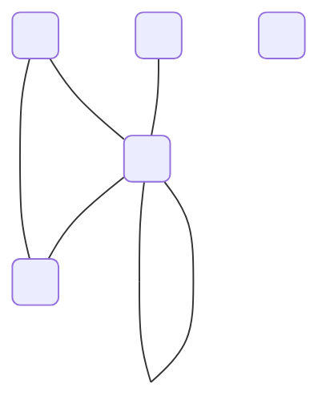
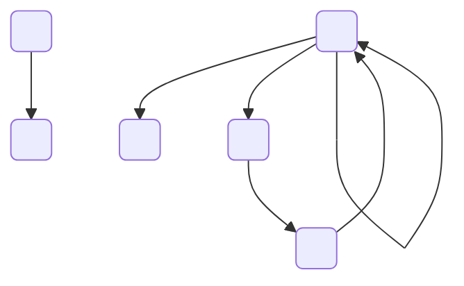
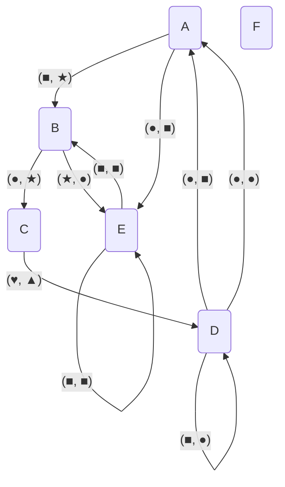
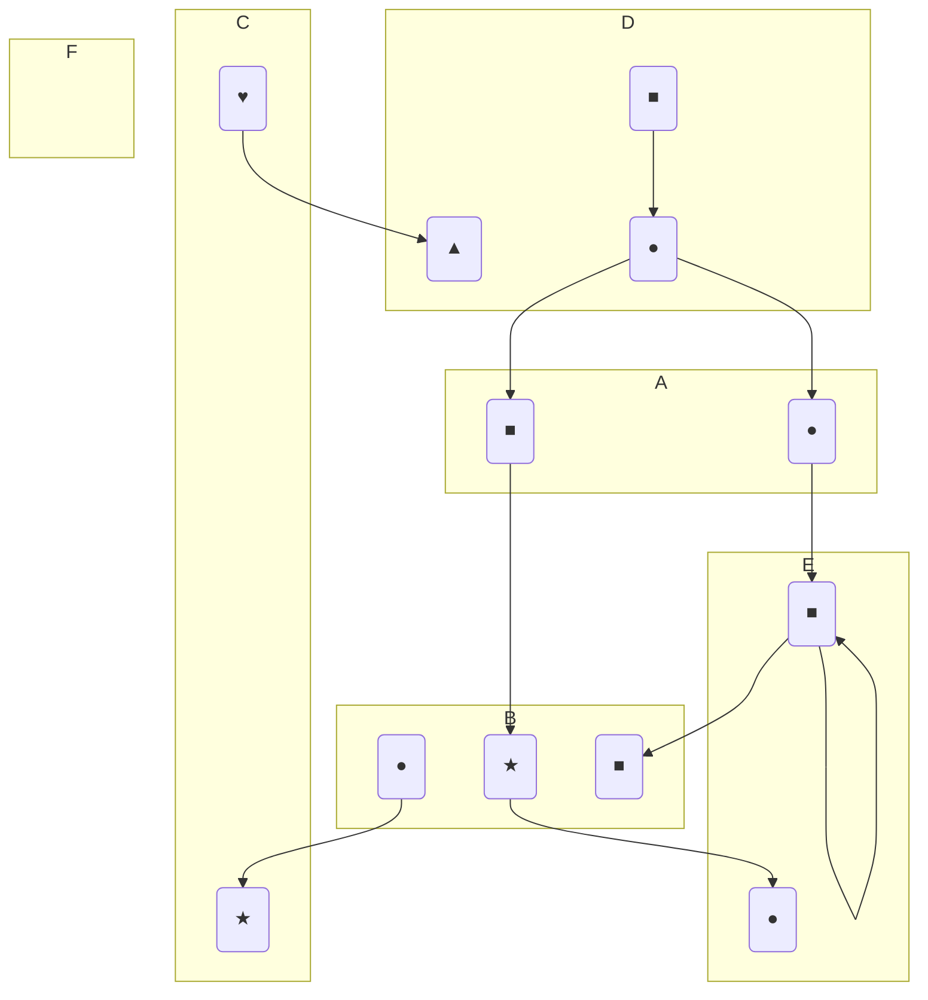

# graph

## Design Considerations

FlexFlow's graph library very intentionally attempts to balance performance and ease of use. 
The graph library aims to have a very simple external interface that is highly decoupled from the underlying representations, so performance and internal implementations can be tuned and modified over time without breaking the code that uses the library.
Because FlexFlow's graphs are not on the scale of machine memory or not so large that single traversals takes nontrivial time, the graph library intentially avoids performance opportunites that would expose many of these performance aspects to user code.
Of course, there are also some optimizations that simply have not been done due to time constraints: for example, algorithms currently are able to be specialized for the underlyign representation being used, but this could be added without modifying the user-side interface.

## Usage

### Core Graph Variants

There is no single type of graph. Should it be directed? Allow multiple edges between nodes? Should nodes and/or edges have information attached?
Because there is no single answer to this question, similar to [networkx](https://networkx.org/) we provide a number of different graph variants. 
At their core, they are as follows:

- `UndirectedGraph`: at most one edge allowed between every pair of nodes, edges are undirected
- `DirectedGraph`: at most one edge allowed between every ordered pair of nodes, edges are directed (i.e., have a source node and a destination node)
- `MultiDiGraph`: arbitrary numbers of edges allowed between every pair of nodes, but each must have not only source/destination nodes but also _source/destination` indices_, which serve to disambiguate different edges between the same nodes. There can exist at most one edge for every ordered tuple of source node, destination node, source index, and destination index.

Examples of the different graph variants are shown below.

Example of `UndirectedGraph`:


Example of `DirectedGraph`:


Example of `MultiDiGraph`:

or visualized a different way,


Note that the nodes and source/destination indices are just nameless things: they have no apparent ordering or other meaning besides representing the topology of the graph.
This is the case as well with `UndirectedGraph`, `DiGraph`, and `MultiDiGraph`.
Nodes are of type `Node`, and from a user perspective are simply opaque handles, and source and destination indices should similarly be considered opaque from a user point of view.
In addition, nodes should only be used in the context of their graph, so comparing or checking equality of nodes between different graphs (even of the same type) is undefined behavior[^1].

All three core graph variants allow insertion and deletion of both edges and nodes. 
To add a node to an `UndirectedGraph g`, simply call `g.add_node()` (the interface is identical for `DiGraph` and `MultiDiGraph`).
To add an edge between two nodes `Node n1` and `Node n2` to an `UndirectedGraph g`, call `g.add_edge({n1, n2})`.
In `UndirectedGraph` the order of the arguments of `add_edge` doesn't matter as edges are undirected, but the order does matter for `DiGraph` and `MultiDiGraph`.
`MultiDiGraph::add_edge` takes in two additional arguments of type `NodePort`, specifying the source and destination indices.
Similar to `Node`s, `NodePort`s can be generated via `g.add_node_port()`.

The last paragraph covered the base API used to write to graphs, but we also want to be able to read from graphs.
Reading from graphs is implemented with the `query_nodes` and `query_edges` methods, which can be thought of as executing a database query over the nodes and edges of the target graph, respectively (where queries are restricted to an incredibly simple set of operations).
The argument to `query_nodes` is a `NodeQuery` (which is simply a set of `Node`s).
`query_nodes` then returns the intersection of the nodes in the graph and the nodes in the query. 
The set of nodes in the query is actually an `optional`, so `nullopt` could also be passed, which would simply retrieve all nodes from the target graph (essentially `nullopt` acts as the set of all nodes that could ever exist).
`query_edges` functions similarly, but as with `add_edge` its behavior is differs slightly between the three graph variants.
`UndirectedGraph::query_edges` simply takes an optional set of nodes and returns all edges that touch any of those nodes.
`DirectedGraph::query_edges` allows separate sets for source and destination nodes, and `MultiDiGraph::query_edges` adds the ability to filter by source and destination indices as well.

In practice you will rarely ever use `query_nodes` and `query_edges` as the graph library provides a large number of algorithms that do that work for you, but it can be helpful to understand this base layer if you ever need to implement your own algorithms.
The layer users will most commonly interact with is the interface provided by [algorithms.h](./algorithms.h), which provides a large number of pre-implemented algorithms on graphs, ranging from as simple as `get_nodes` to as complex as `get_transitive_reduction` and `get_dominators`.
You may notice that the most of the functions declared in `algorithms.h` take as arguments not `UndirectedGraph`, `DiGraph`, and `MultiDiGraph`, but actually operator on `UndirectedGraphView`, `DiGraphView`, and `MultiDiGraphView`. 
These `GraphView` objects represent read-only (i.e., immutable) graphs.
Similar to C++'s `const` semantics, `Graph`s can be coerced[^2] to `GraphView`s but not the other way around.
To transform a `GraphView` to a `Graph`, we can perform an explicit copy with `materialize_view`.
Both `Graph` and `GraphView` types follow normal value semantics. 
This may seem wasteful (oftentimes graphs are large objects that are passed around via reference to avoid making additional copies), but the `Graph` and `GraphView` types internally implement copy-on-write optimizations to only perform the minimum number of actual copies while maintaining immutability and lifetime safety (if you allocate a `DiGraph` use for example `get_subgraph` to get a `DiGraphView` representing a part of this graph, modifications to the underlying `DiGraph` will not be mirrored in the `DiGraphView` and the `DiGraphView` will remain valid even after the base `DiGraph` leaves scope.

At this point, however, we still have not discussed how to create a graph.
The user-facing graph interface is intentially separated from the underlying graph representations, so representations can be changed without requiring any user-side code modifications besides the choice of which implementation to use.
For example, to construct a `DiGraph` which internally uses a representation `MyDiGraphImpl`:
```cpp
DiGraph g = DiGraph::create<MyDiGraphImpl>();
```
Generally users will use underlying representations provided by the graph library, but advanced users can create their own implementations (see the [Internals](#internals) section).

[^1]: At some point we will likely add actual runtime checks on this, but for now we rely on the user not to mess up. Currently the implementation will keep going silently until the incorrectness grows so large that something breaks/crashes.
[^2]: See <https://en.wikipedia.org/wiki/Type_conversion> if you're not familiar with the term _type coercion_

### Labelled Graphs

As nice as all of the above is, graphs without labels are mostly useless--in practice, nodes and edges represent some other system and the properties of that system (or at least a way to map the result of graph algorithms back to the underlying system) are necessary.
Thus, FlexFlow's graph library provides the ability to add labels via [labelled\_graphs.h](./labelled_graphs.h): examples include `NodeLabelledMultiDiGraph<T>` (nodes have labels of type `T` and edges are unlabelled) and `OutputLabelledMultiDiGraph<T, U>` (nodes have labels of type `T` and source indices have labels of type `U`).
While the interfaces of these graphs differ slightly from the core graph variants, they still have corresponding `GraphView` types, `add_node`/`add_edge` methods, and `query_nodes`/`query_edges` methods.
Note that all of the labelled graph types require that each element of the labelled types have a label (e.g., every node in a `NodeLabelledMultiDiGraph<T>` must have a label of type `T`)., which is enforced via the interfaces they provide.
Partial labelling can be implement via wrapping the label type in `optional`.
Interacting with `Node` and `Edge` objects is still necessary to use the labelled graph types: intuitively the labelled graph types can be thought of as a pair of a core graph variant and a hash map the maps nodes (or other types depending in which labelled graph type is used) to labels.
As such, the labelled graph types provide the typical `at` method (as on `std::unordered_map`[^3]) and can be coerced to their underlying core graph variants for use in functions provided by `algorithms.h`, etc.

[^3]: `operator[]` currently is not present because all nodes must have labels and we don't require label types to be default constructible, though some simple template programming could probably add `operator[]` support in the cases where the label types _are_ default constructible.

## Internals

TODO @lockshaw
